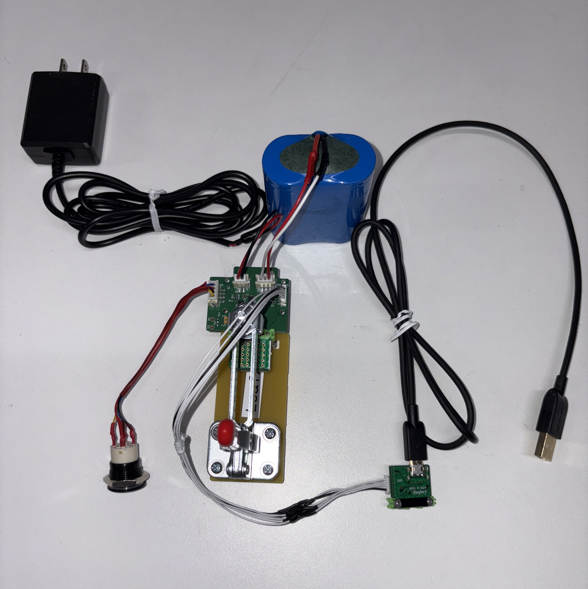

# Solar 3.2V 検査手順
## はじめに
本内容は、Solar 3.2V の検査検査手順を記します。
## 用意するもの
### Solar 3.2V AS
* AP03 STM32 MCU  
* AV05 Solar 3.2V
* AX02 29 pin

### Solar-charger-debugger AS
* [Solar-charger-debugger-Leaf](https://github.com/Leafony/HW-Design-Files/tree/master/Solar-charger-debugger-Leaf) [^1]
* AZ01 USB
* AZ63 Nut Plate
* M2X8mm ネジ
* USBケーブル 
[^1]:Solar-charger-debugger-Leafは、高さ約3mmなので必ず上段にすること
### その他
* PC
* テスター
* リーフ組立て治具(Leafx3)
* リン酸鉄リチウムイオンバッテリ
* ACアダプタ DC12V
* スイッチ
* 6p-SHコネクタ・ケーブル

## ソースコード
* [Leaf_Solar_Test.ino](https://github.com/Leafony/Sample-Sketches/blob/master/Leaf_Solar_Test/Leaf_Solar_Test.ino)
## 組立て


|Stack No| Leaf | 
| :---  | :--- | 
|1 | AX02 29 pin |
|2|  AP03 STM32 MCU| 
|3|  AV05 Solar 3.2V| 
* **29 pinのコネクタは、外して使用します。**


## 検査方法
1.Solar-charger-debuggerをRunモードにする。


2.スイッチを押すとLEDが点滅し、Solar-charger-debuggerのLEDが点灯します。

3.次に、Arduino IDEでシリアルモニタを立ち上げ、テキストボックスに、コマンド`m`を入力すると以下のメニュー画面が表示されます。
 ```
 m = This Menu
 1 = KTD: LED start
 2 = KTD: LED stop
 3 = TCA: Initialize
 4 = TCA: Read register
 5 = TCA: ONVCC_High
 6 = TCA: ONVCC_Low
 7 = ADC: Initialize
 8 = ADC: AD convert
 ```
4.コマンド`1`と`2`を入力し、スイッチのLEDの点滅と消灯を確認します。

5.Solar-charger-debugger-Leafにテスターを当て、3.3V±0.3Vを確認します。
 
6.コマンド`5`を入力し、5V電源がON（負荷が無いため実測5.2～5.3V）であることを確認します。

7.コマンド`4`を入力し、IOExpanderリードさせて、充電のON/OFFを以下の表示を確認します。

| 充電 | ACアダプター | バッテリー | 表示|
| :---  | :--- | :--- | :--- |
|OFF |  無し | 有り |"Addr_0x00 = f0" |
|ON|  有り | 有り | "Addr_0x00 = f1"  |

8.コマンド`8`を入力し、A/D変換値リードさせて、ACアダプター無し、バッテリーのみで、バッテリーの電圧を確認します。

