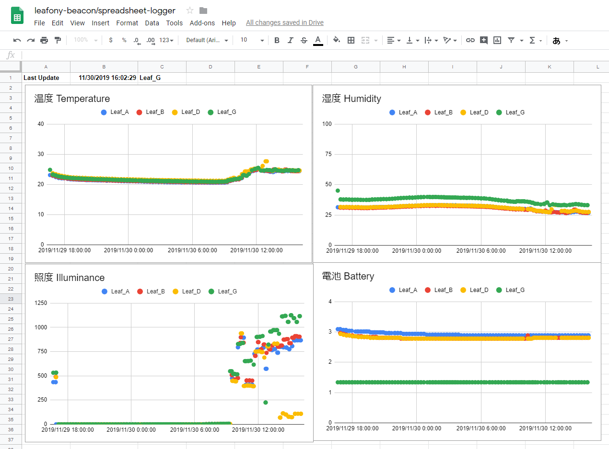

# spreadsheet-logger
A data logger for Leafony beacons with Google SpreadSheet.



## Prerequisites

* Node.js `14.x` or later

## Install

### Ubuntu/Debian

```sh
sudo apt-get install bluetooth libbluetooth-dev libudev-dev
git clone https://github.com/Leafony/Sample-Sketches/
cd STM32_Logger_Beacon/spreadsheet-logger
npm install
```

### Raspberry Pi (Raspbian)

```sh
sudo apt update
sudo apt upgrade

# Check node.js version
node -v
# If node is not installed
curl -sL https://deb.nodesource.com/setup_14.x | sudo -E bash -
sudo apt install nodejs

# Install required libraries
sudo apt install -y bluetooth libbluetooth-dev libudev-dev git
# Clone this repository and install required packages
git clone https://github.com/Leafony/Sample-Sketches/
cd STM32_Logger_Beacon/spreadsheet-logger
npm install
```

### Fedra/ Other-RPM based

```sh
sudo yum install bluez bluez-libs bluez-libs-devel
git clone https://github.com/Leafony/Sample-Sketches/
cd STM32_Logger_Beacon/spreadsheet-logger
npm install
```

## Usage

Change `spreadsheetID` and `sheetName` according to your sheet.

```Javascript
const spreadsheetId = '<YOUR SPREADSHEET ID HERE>';
const sheetName = 'Sheet1';
```

In order to access to Google Sheets API, you have to create credentials of Google Cloud Platform. See [Create credentials](https://developers.google.com/workspace/guides/create-credentials) and download your service account credentials.

Put your `credentials.json` in this project directory and run this script.

```sh
sudo npm start
``` 

Only the first run, authentication messages will appear. Please follow the steps and copy & paste your auth ID.

## License
MIT